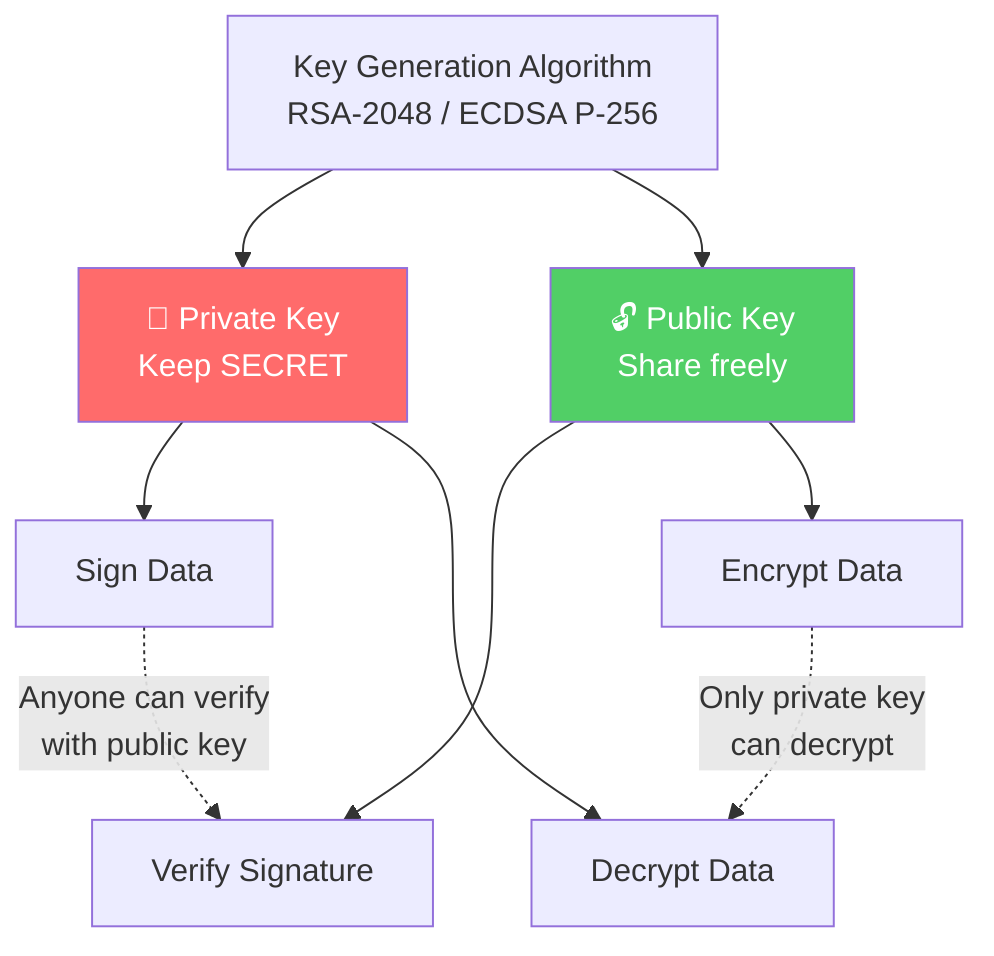
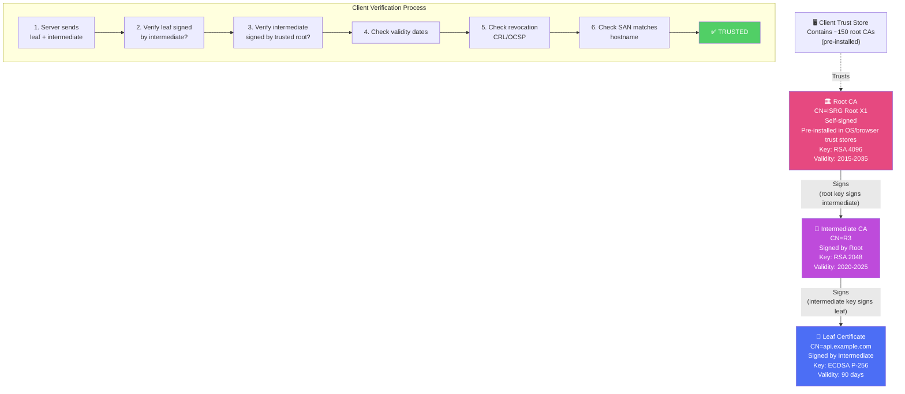
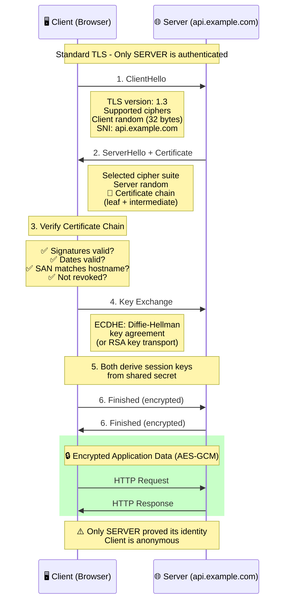
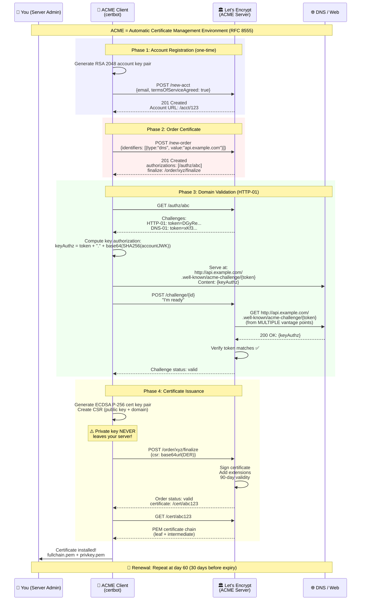
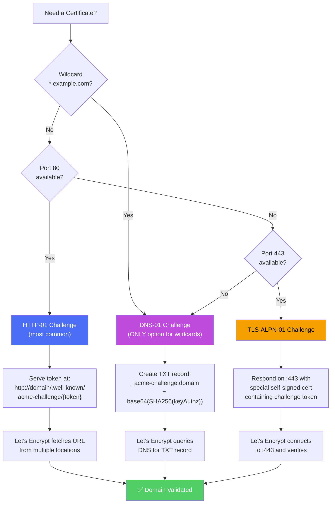
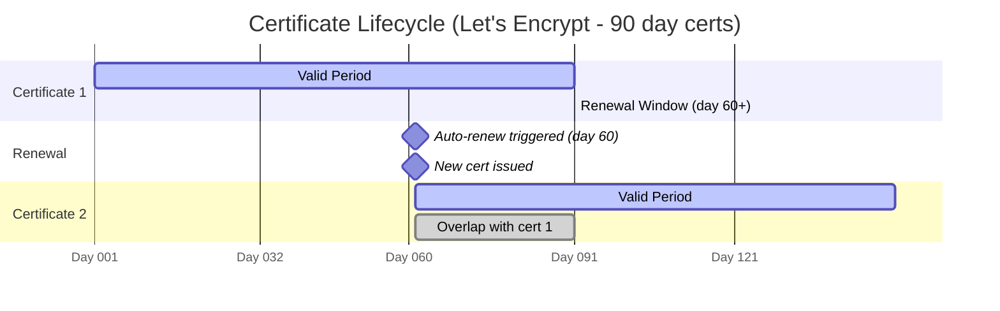
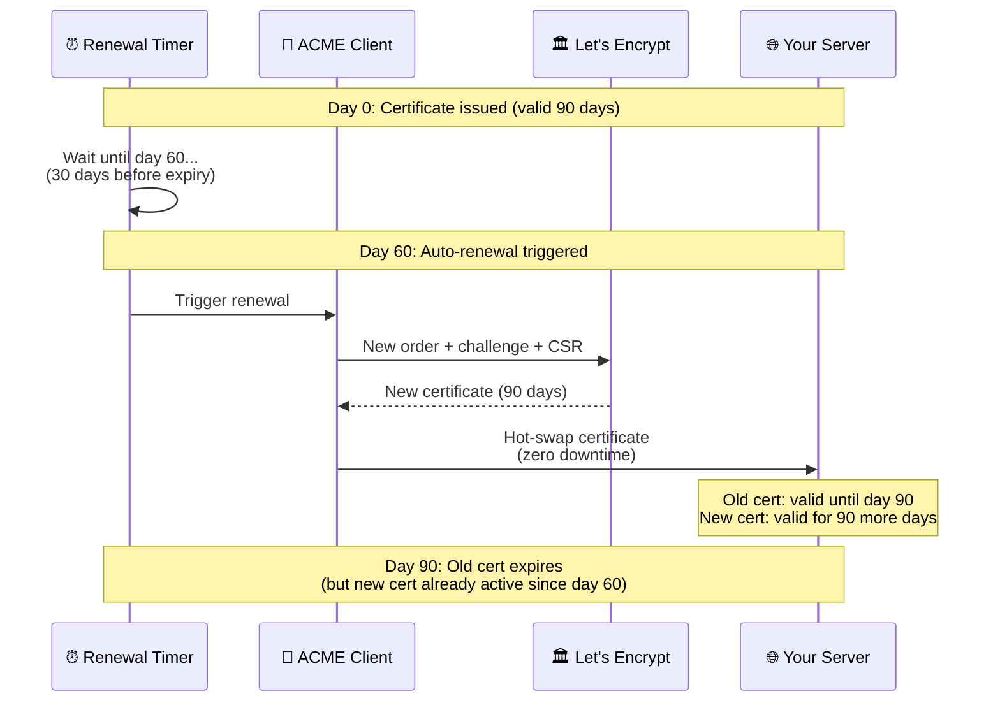
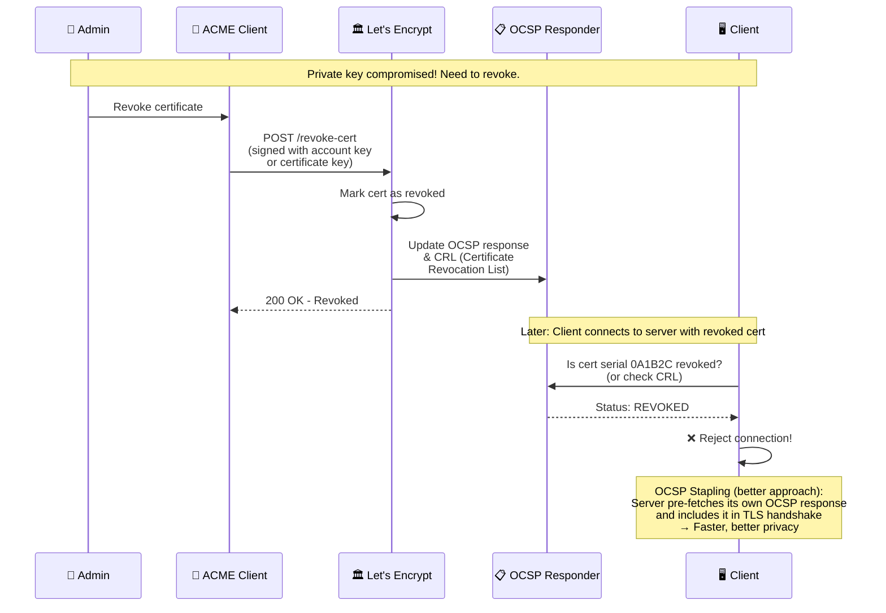

# 01 - TLS Fundamentals & Let's Encrypt - Diagrams

## 1.1 Asymmetric Cryptography - How Key Pairs Work

## 1.2 Certificate Chain of Trust

## 1.3 One-Way TLS Handshake (Standard HTTPS)

## 1.4 ACME Protocol - Let's Encrypt Certificate Issuance

## 1.5 ACME Challenge Types Comparison

## 1.6 Certificate Lifecycle

## 1.7 Revocation Flow

## 1.8 RSA vs ECDSA Key Comparison

```mermaid
flowchart LR
    subgraph RSA["RSA-2048"]
        R1["Key Size: 2048 bits"]
        R2["Signature: ~256 bytes"]
        R3["Speed: Slower"]
        R4["Security: ~112-bit"]
        R5["Support: Universal"]
    end

    subgraph ECDSA["ECDSA P-256 ✅ Recommended"]
        E1["Key Size: 256 bits"]
        E2["Signature: ~64 bytes"]
        E3["Speed: Faster"]
        E4["Security: ~128-bit"]
        E5["Support: Growing"]
    end

    RSA ---|"Same security<br/>with 8x larger keys"| ECDSA

    style ECDSA fill:#d3f9d8,stroke:#51cf66
    style RSA fill:#fff3bf,stroke:#f59f00
```

