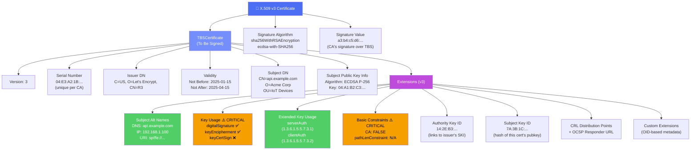
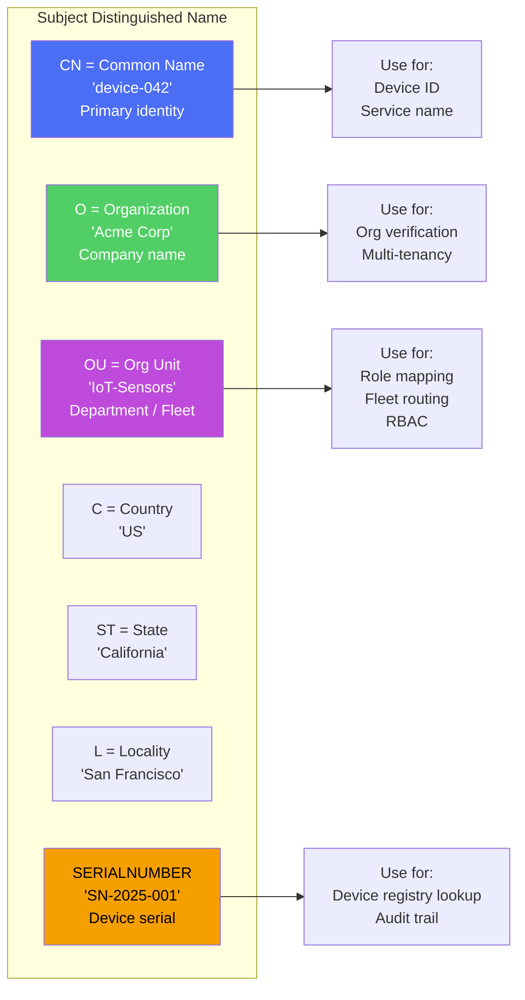
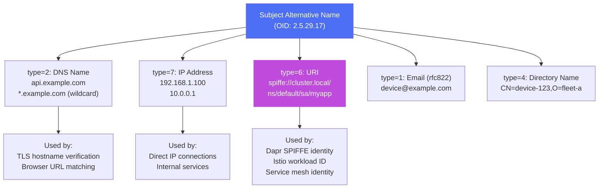
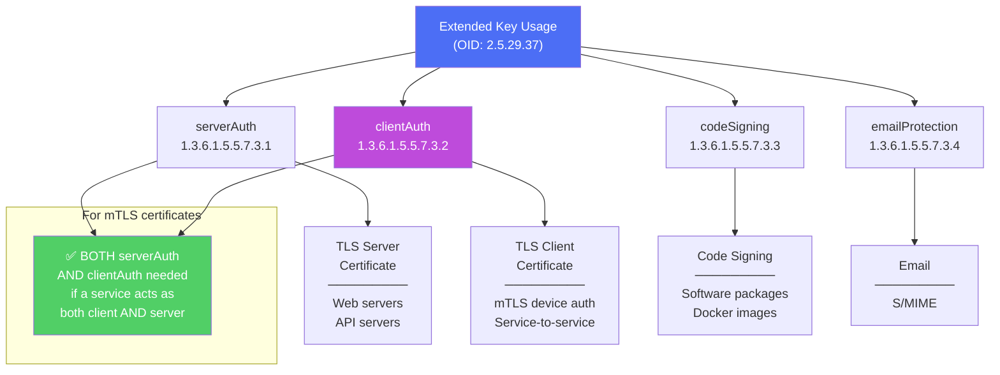
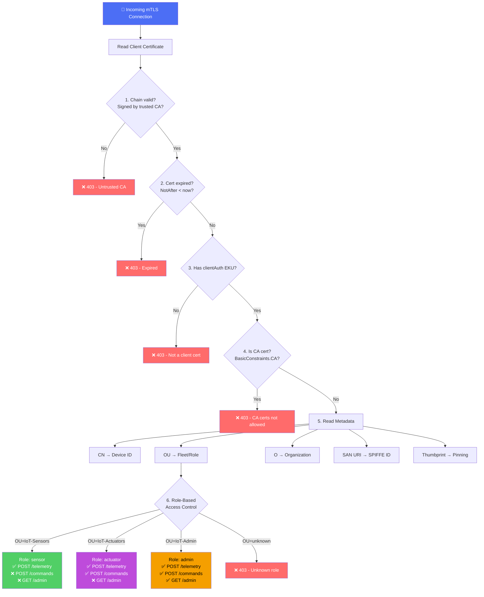
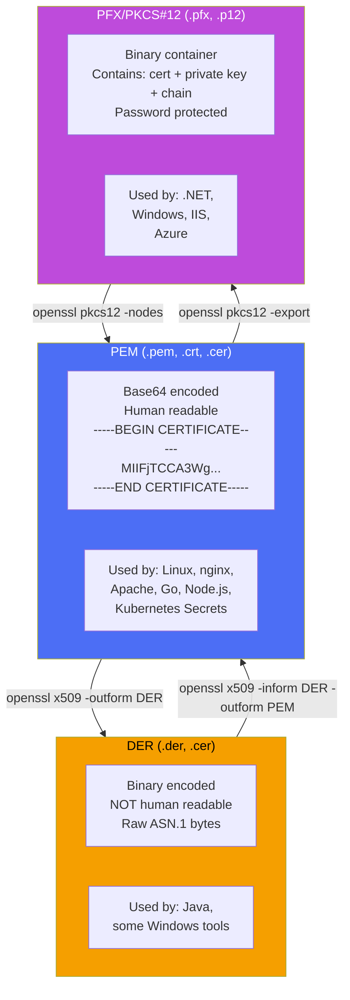
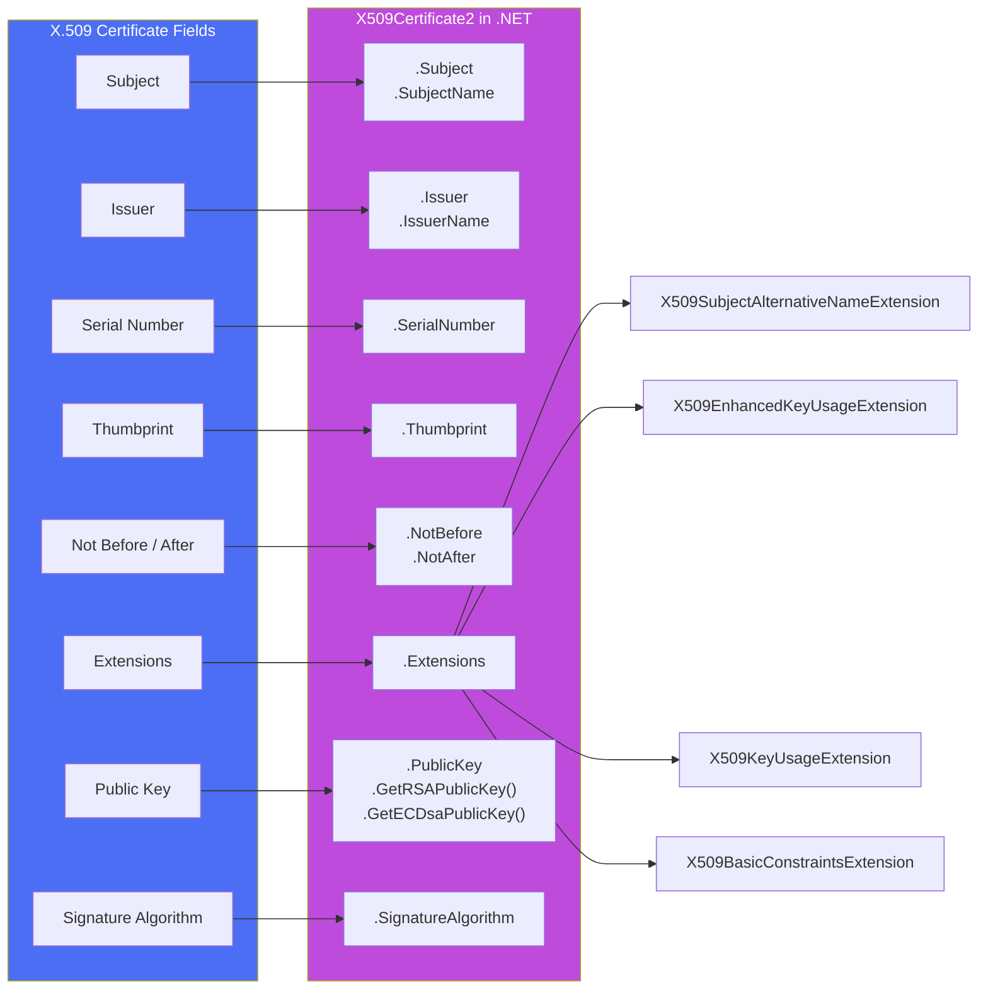

# 02 - Certificate Metadata - Diagrams

## 2.1 X.509 v3 Certificate Structure (Complete)

## 2.2 Subject Distinguished Name (DN) Fields

## 2.3 Subject Alternative Name (SAN) Types

## 2.4 Extended Key Usage - What Each OID Means

## 2.5 Decision Making from Certificate Metadata

## 2.6 Certificate Encoding Formats

## 2.7 Certificate Fields → .NET X509Certificate2 Property Map

