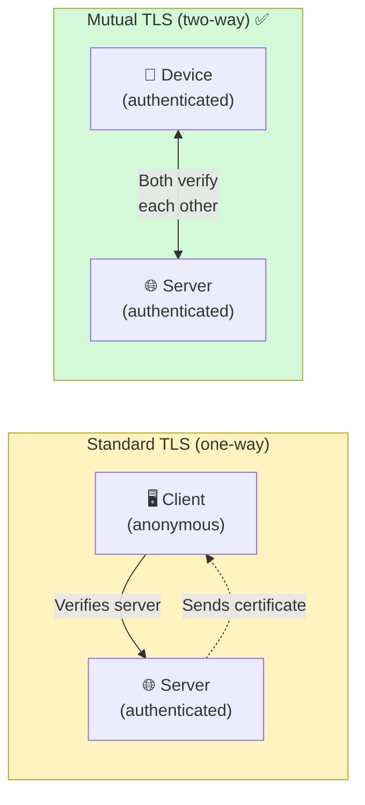
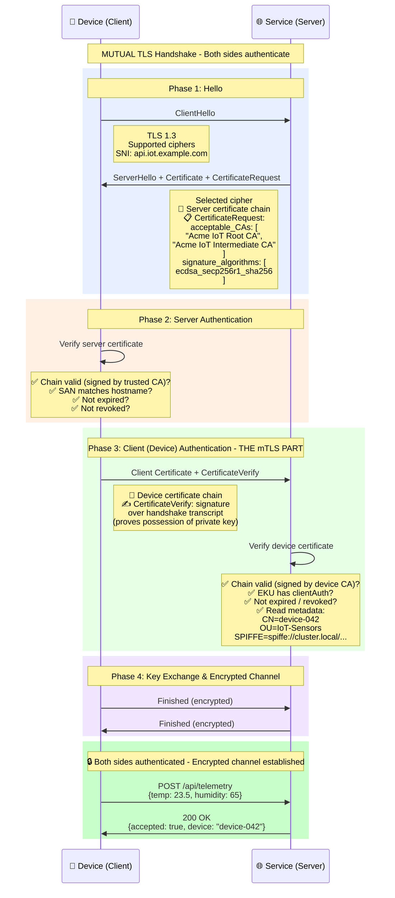
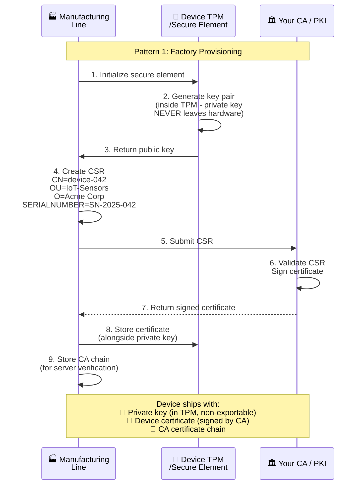
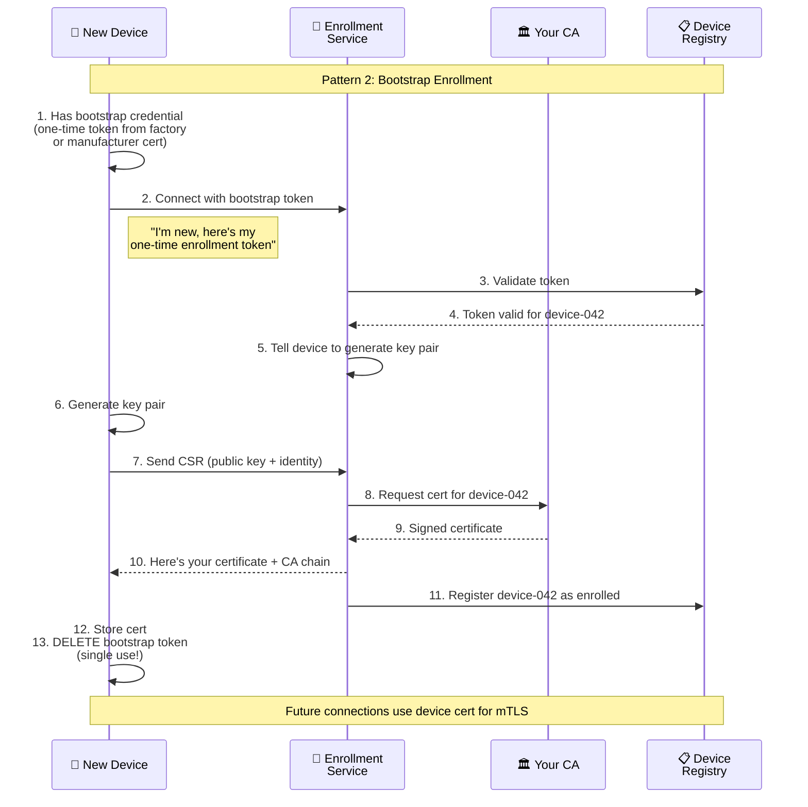
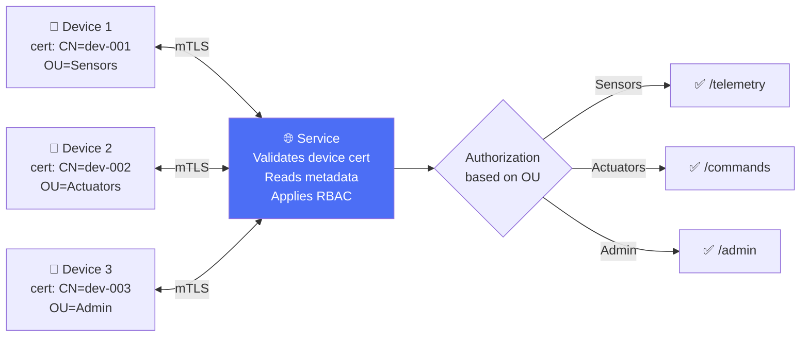
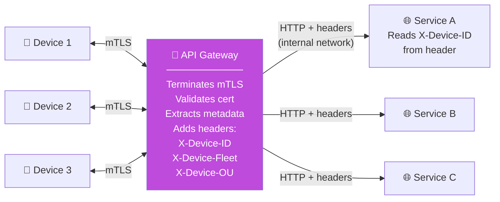
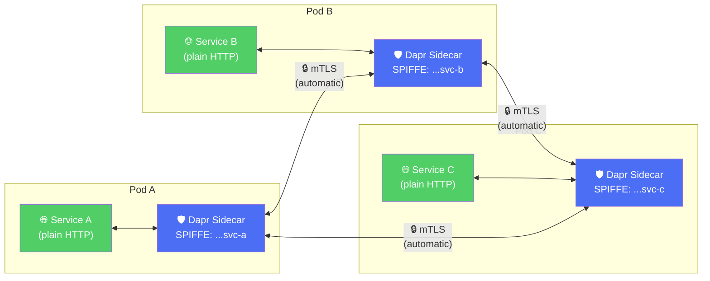
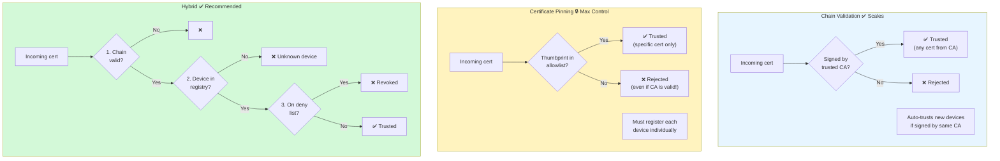

# 03 - mTLS Device-to-Service - Diagrams

## 3.1 Standard TLS vs mTLS

## 3.2 mTLS Handshake - Full Sequence

## 3.3 Device Certificate Provisioning - Factory Pattern

## 3.4 Device Certificate Provisioning - Enrollment/Bootstrap Pattern

## 3.5 Architecture Pattern A: Direct mTLS

## 3.6 Architecture Pattern B: mTLS Gateway

## 3.7 Architecture Pattern C: Service Mesh (Dapr/Istio)

## 3.8 Certificate Pinning vs Chain Validation

