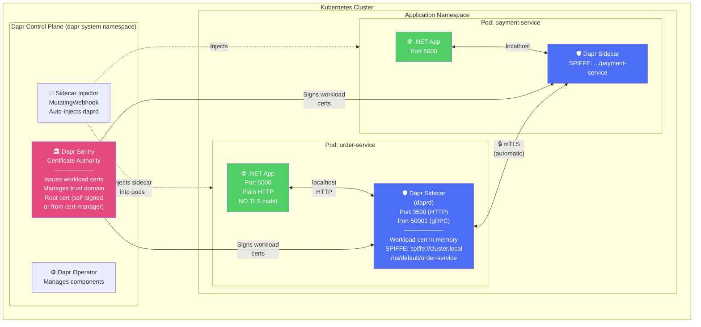
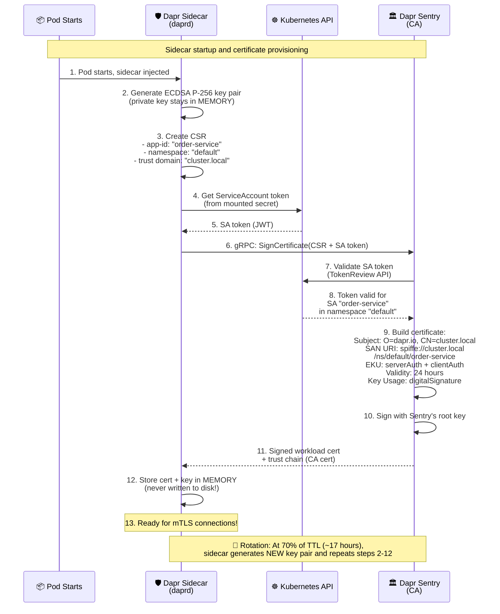
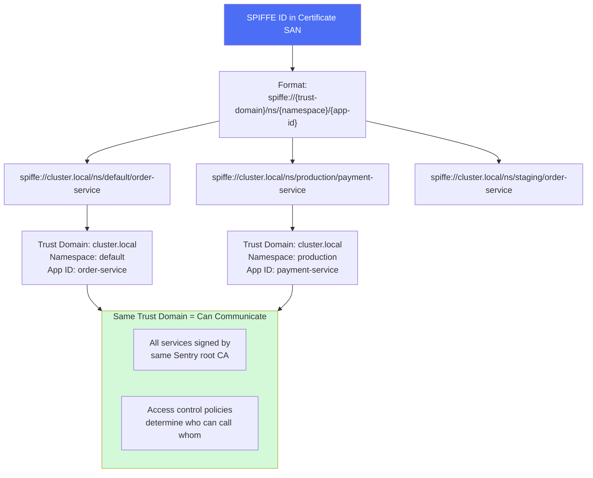
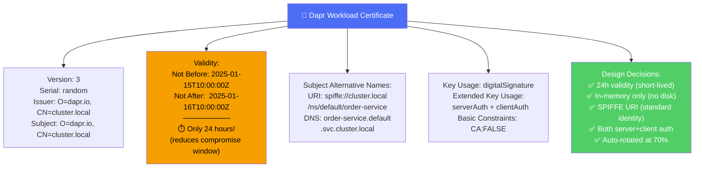
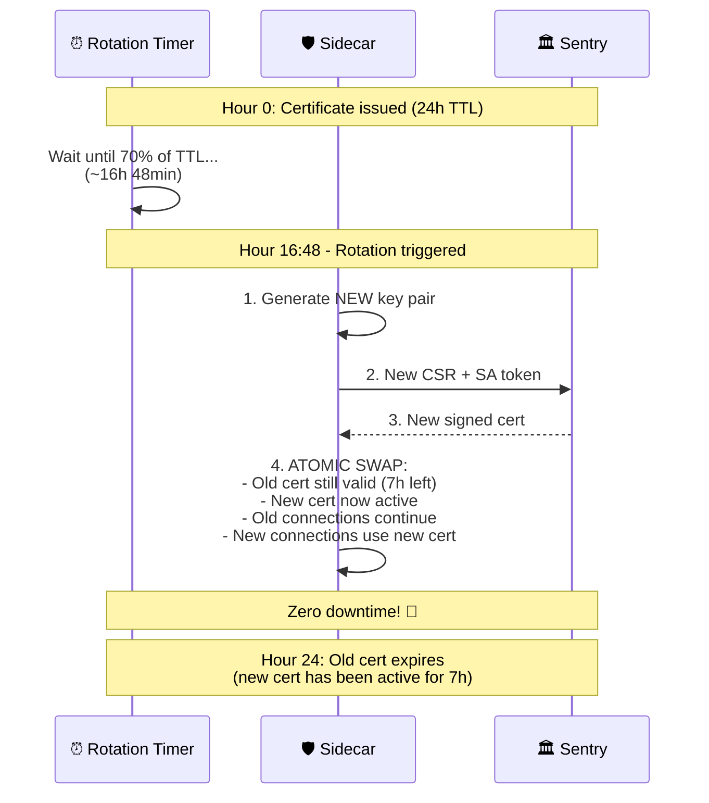
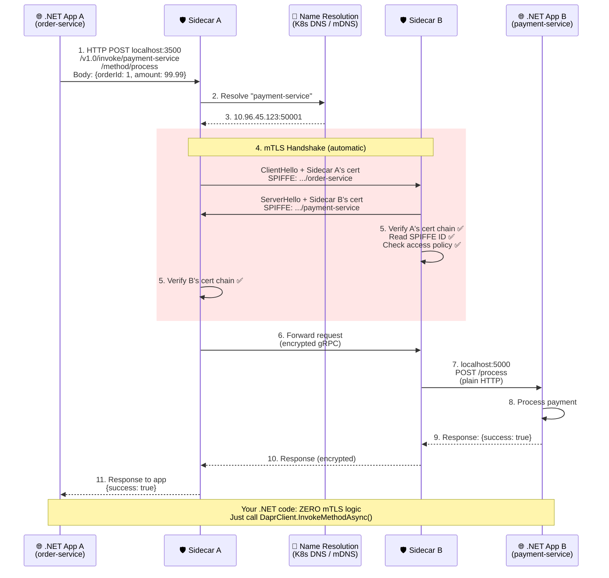
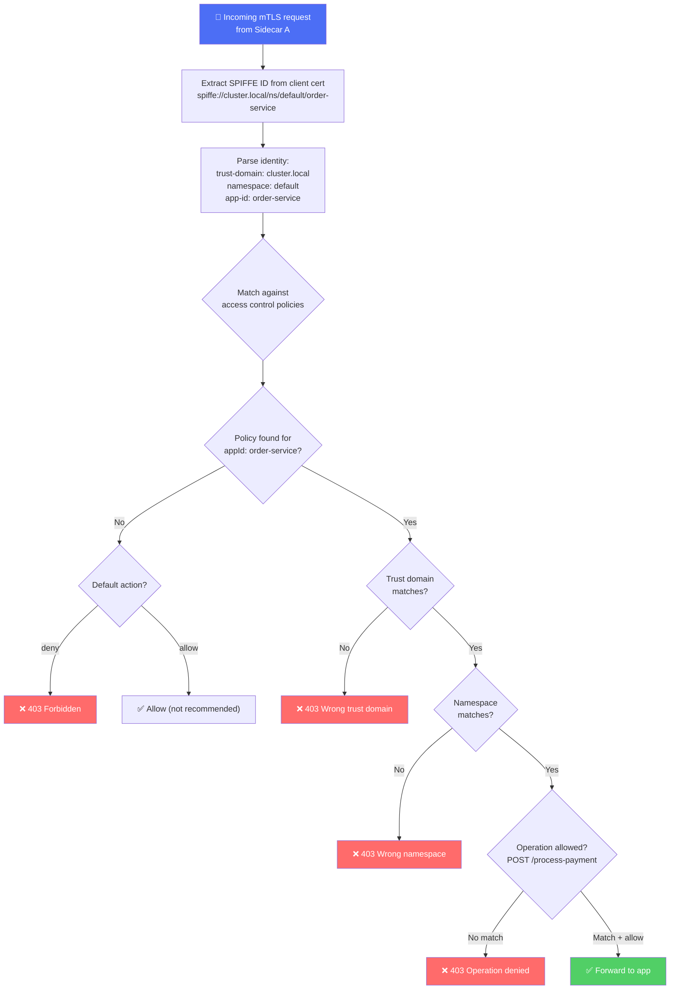
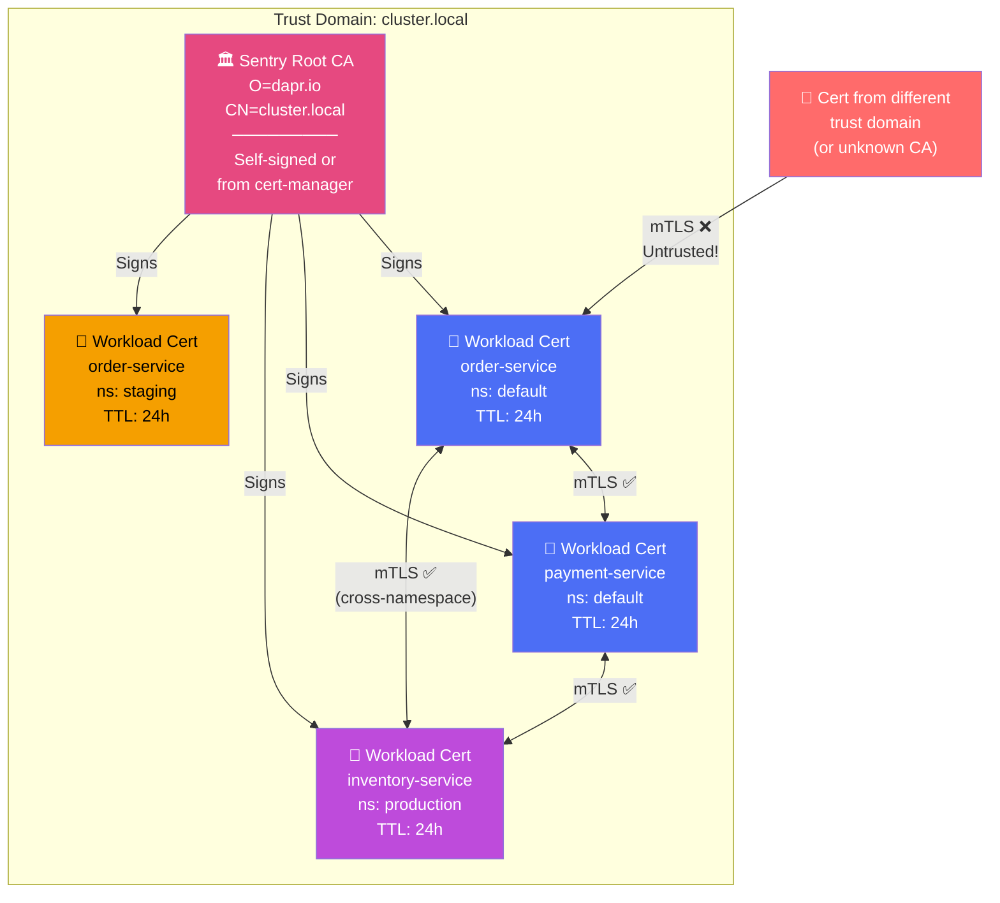
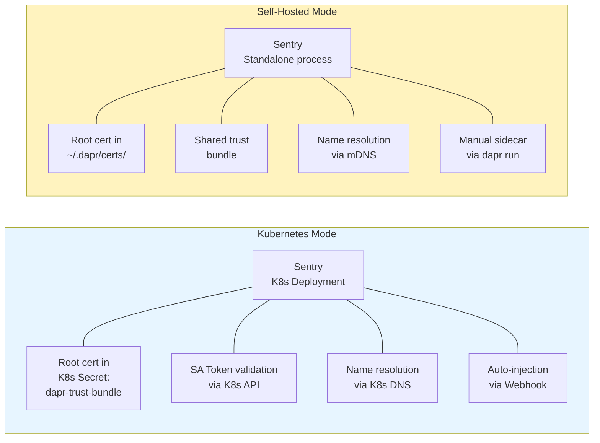

# 04 - Dapr mTLS Architecture - Diagrams

## 4.1 Dapr Sidecar Architecture Overview

## 4.2 Sentry Certificate Signing Flow

## 4.3 SPIFFE Identity in Dapr

## 4.4 Workload Certificate Contents

## 4.5 Certificate Auto-Rotation Timeline

```mermaid
gantt
    title Dapr Workload Certificate Rotation (24h TTL)
    dateFormat HH:mm
    axisFormat %H:%M

    section Cert 1
    Valid (24h)              :active, c1, 00:00, 24h
    Rotation trigger (70%)   :crit, r1, 16:48, 0h

    section Cert 2
    Valid (24h)              :active, c2, 16:48, 24h
    Overlap with Cert 1      :done, o1, 16:48, 7h
```

## 4.6 Dapr Service Invocation with mTLS

## 4.7 Dapr Access Control Policy Enforcement

## 4.8 Dapr Trust Hierarchy

## 4.9 Kubernetes vs Self-Hosted Dapr

