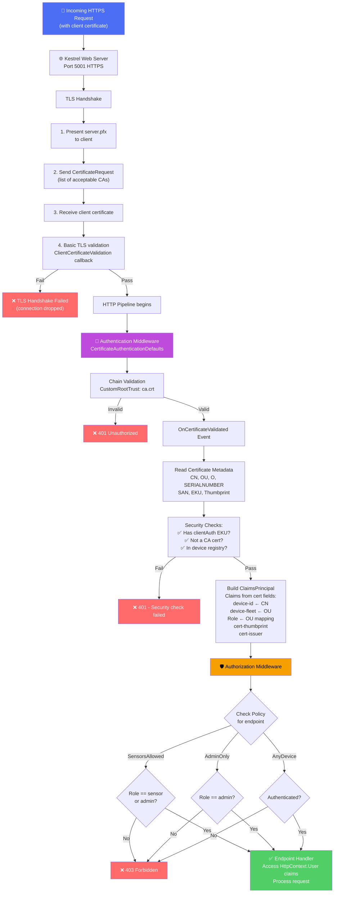
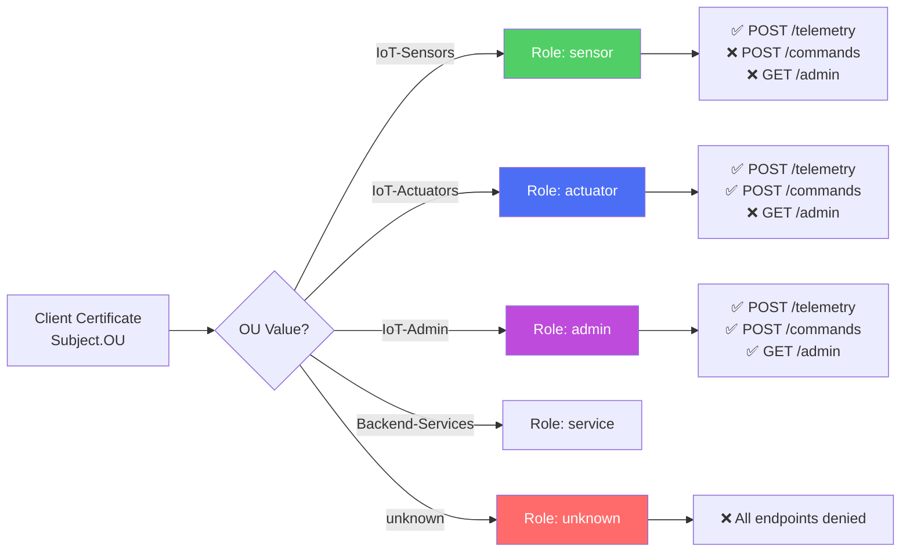
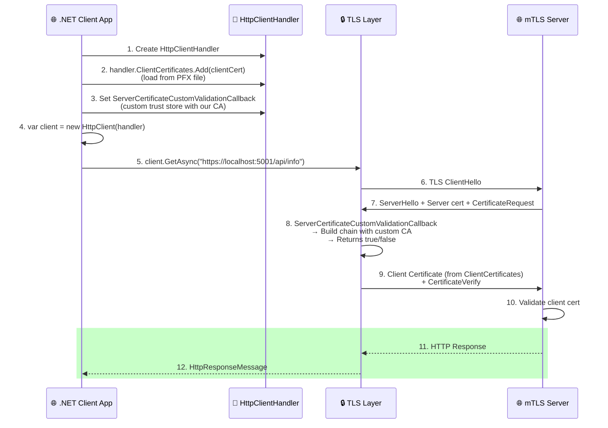
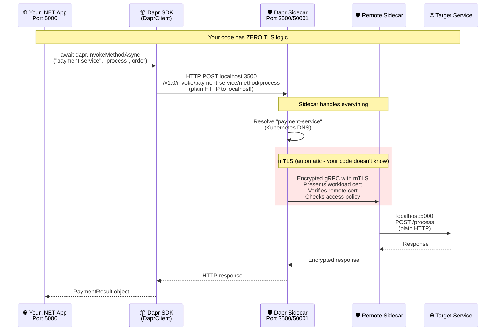
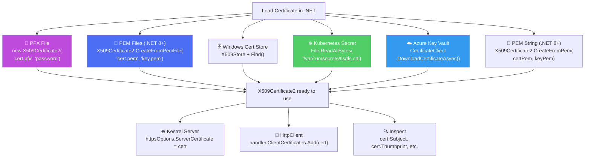
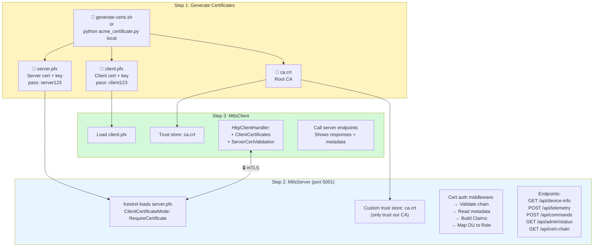

# 05 - .NET Integration - Diagrams

## 5.1 ASP.NET Core mTLS Request Pipeline

## 5.2 Certificate OU → Role Mapping

## 5.3 .NET HttpClient mTLS Configuration

## 5.4 .NET Dapr SDK Flow (Zero mTLS Code)

## 5.5 Certificate Loading in .NET - All Sources

## 5.6 Complete .NET mTLS Demo Architecture

