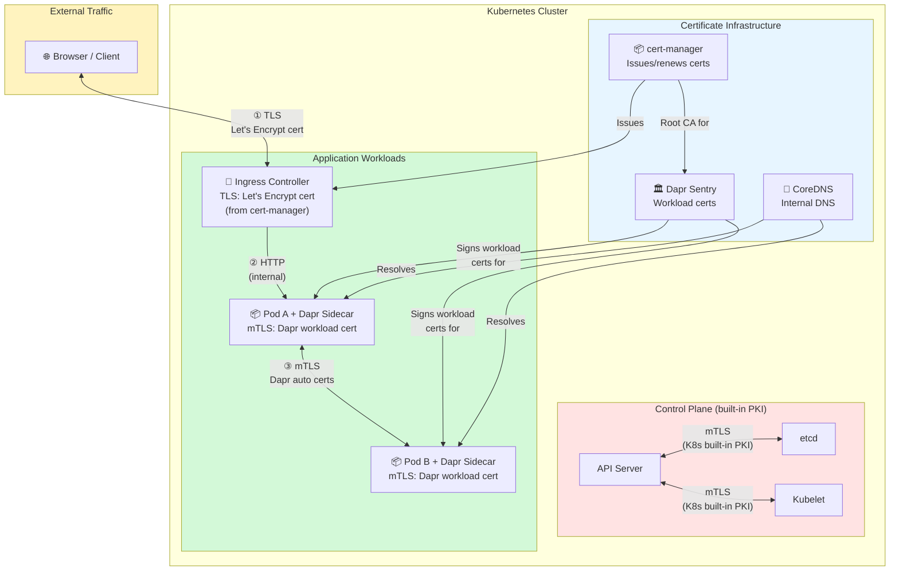
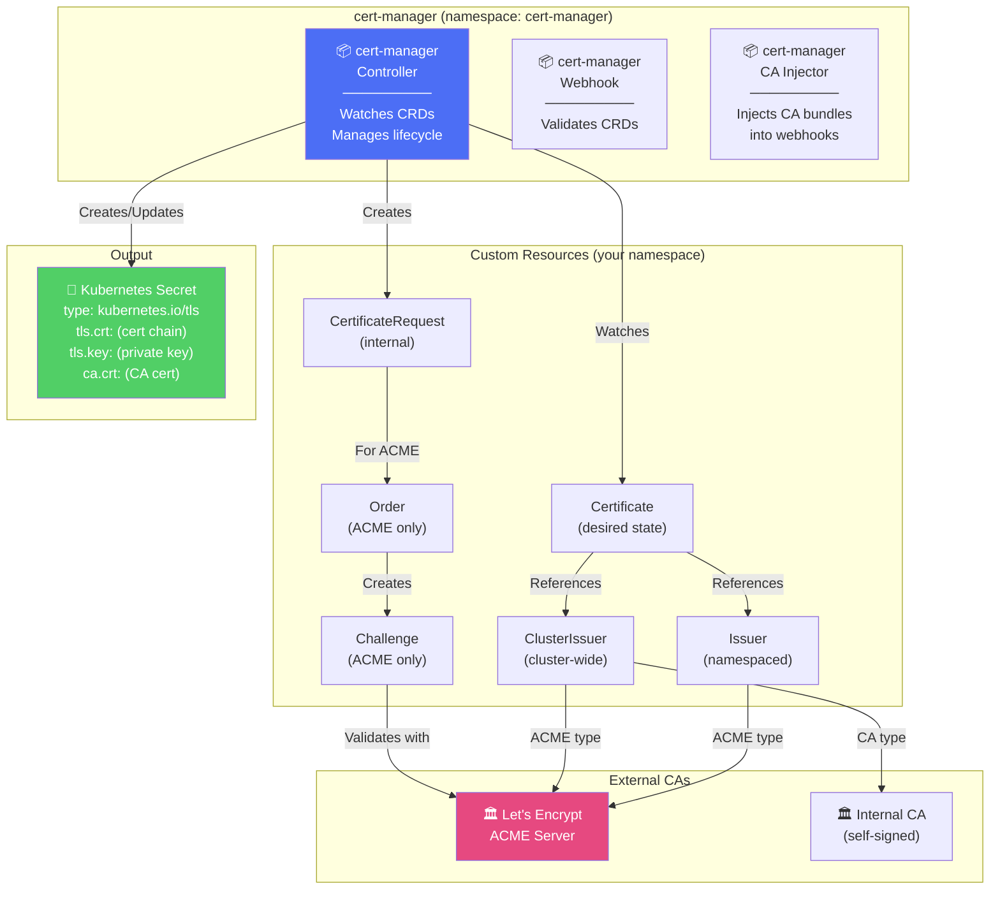
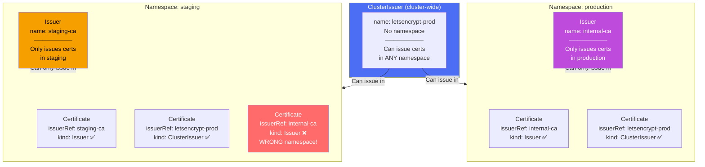
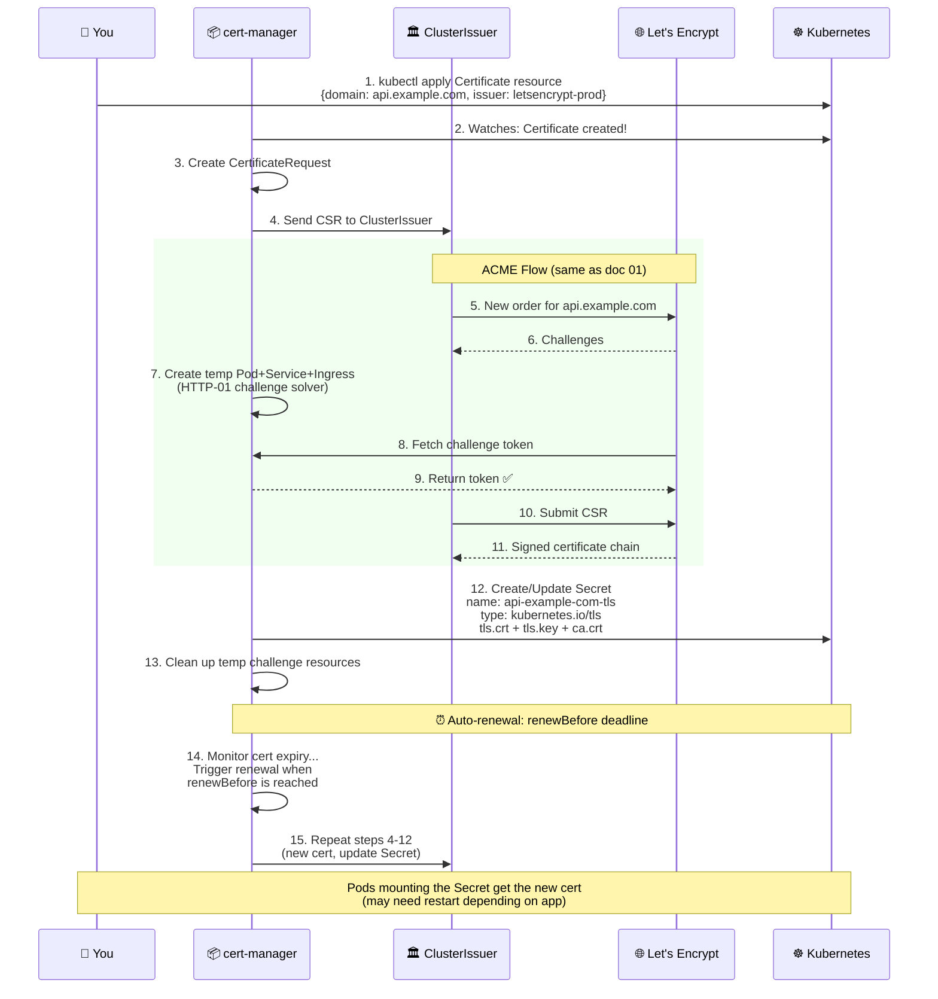
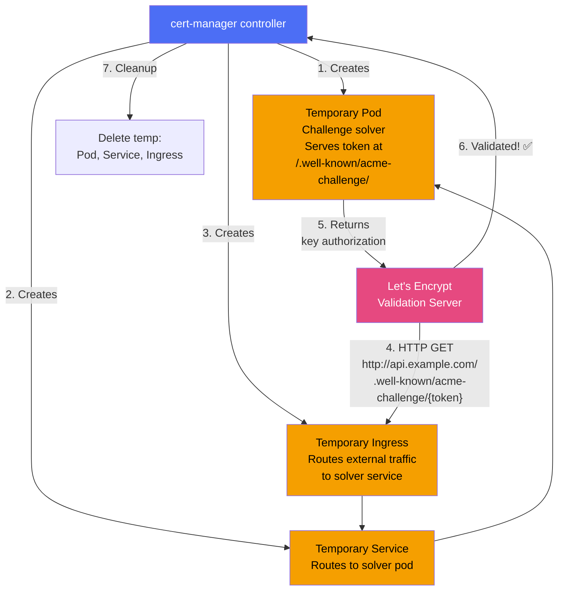
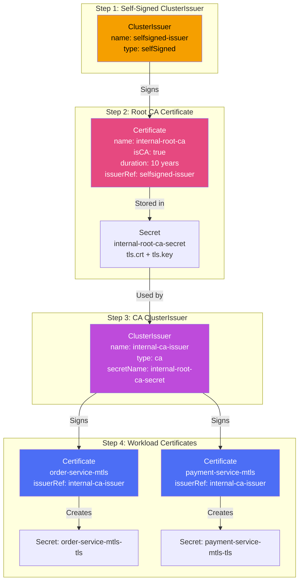
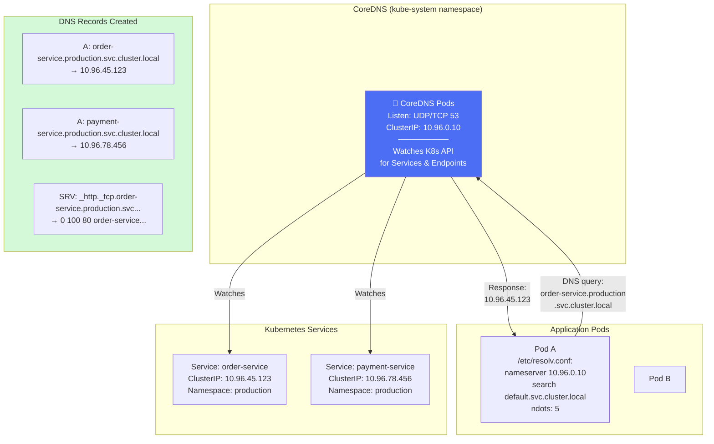
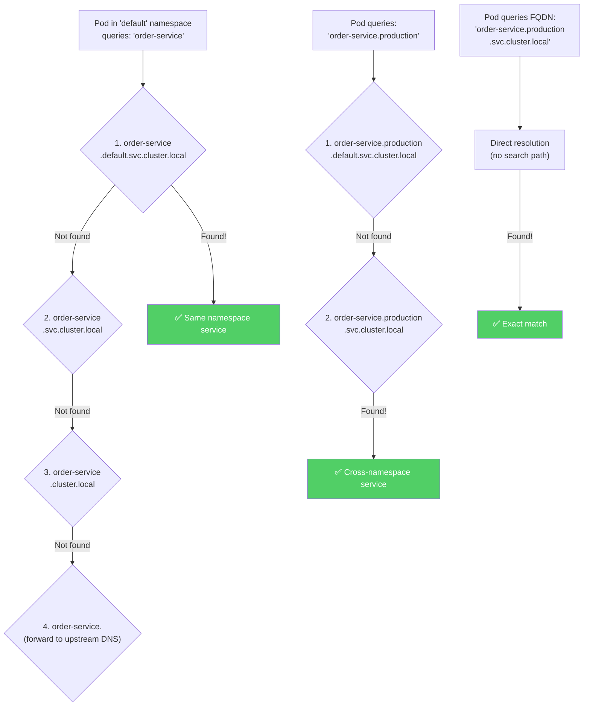
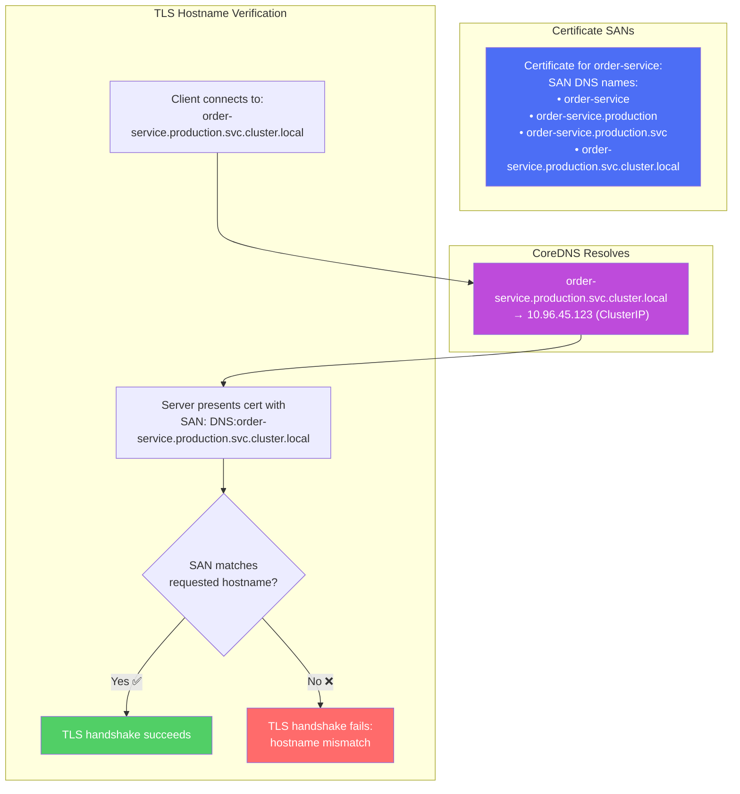
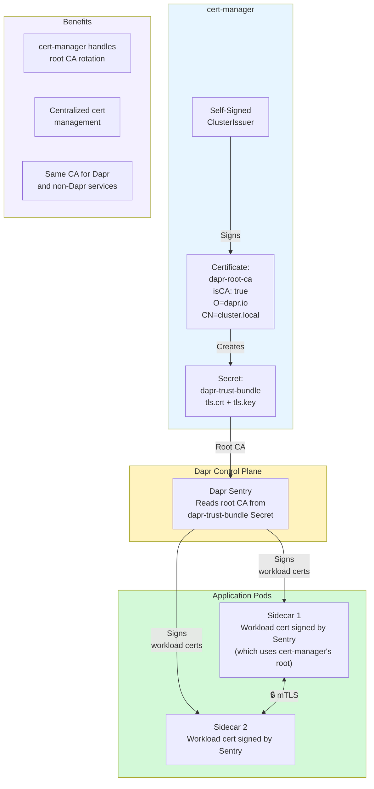

# 06 - Kubernetes cert-manager & CoreDNS - Diagrams

## 6.1 Certificates in Kubernetes - The Big Picture

## 6.2 cert-manager Architecture

## 6.3 Issuer vs ClusterIssuer

## 6.4 Certificate Lifecycle in cert-manager

## 6.5 ACME HTTP-01 Challenge in Kubernetes

## 6.6 Internal CA Bootstrap with cert-manager

## 6.7 CoreDNS Architecture

## 6.8 DNS Name Resolution and Search Domains

## 6.9 DNS ↔ Certificate SAN Relationship

## 6.10 cert-manager + Dapr Integration

