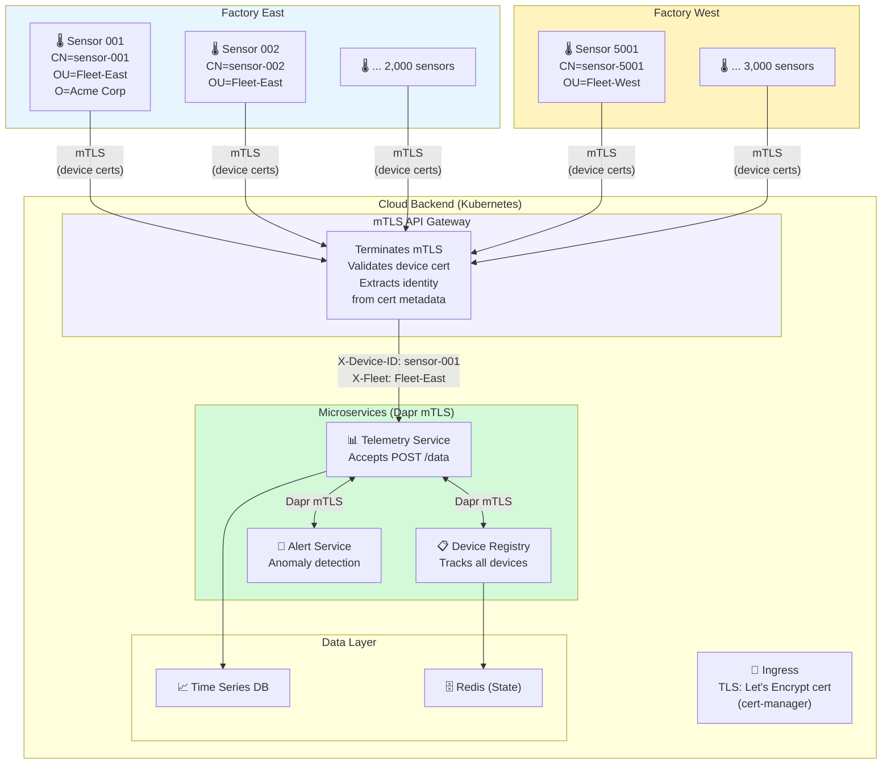
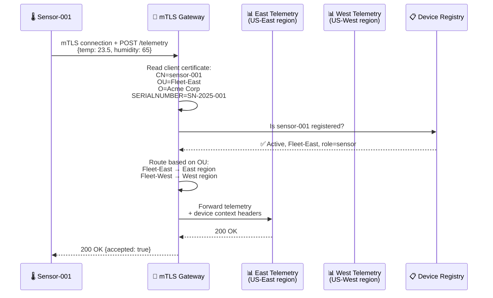
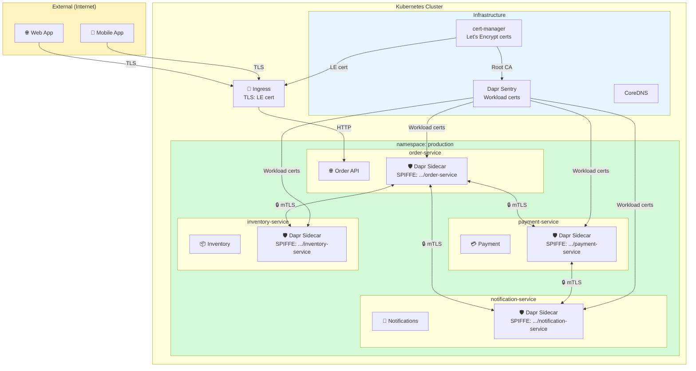
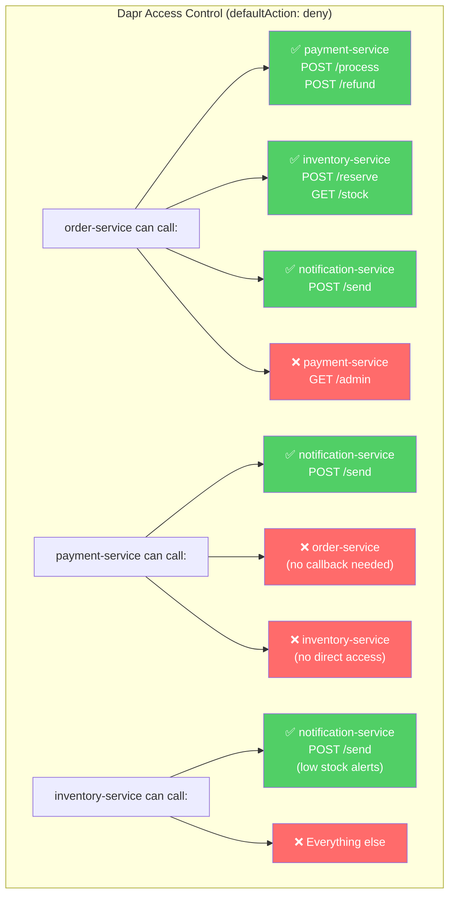
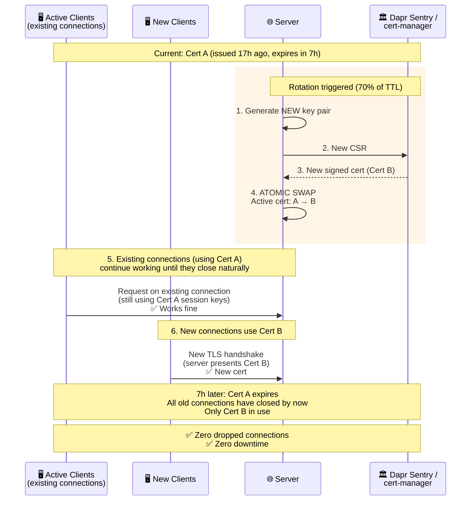
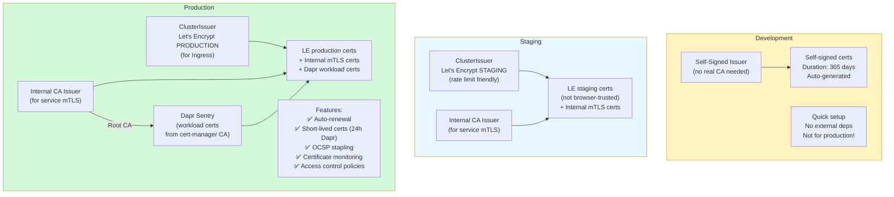
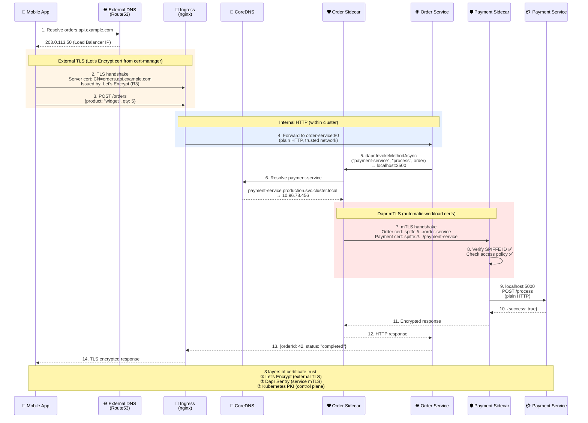
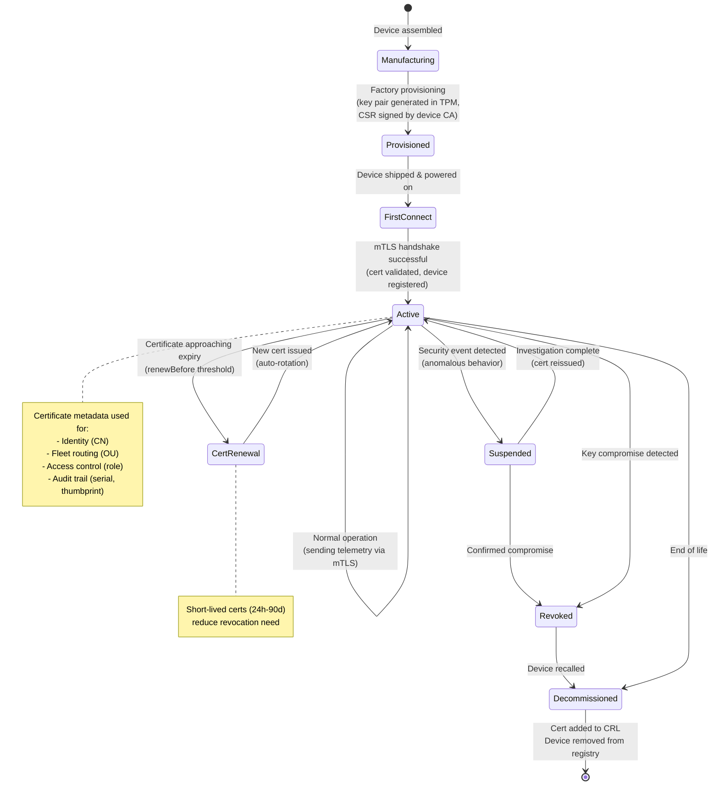
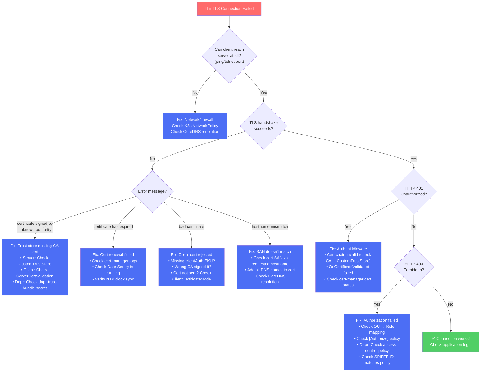

# 07 - End-to-End Use Case Scenarios - Diagrams

## Use Case 1: IoT Fleet Management with mTLS

### Scenario
A company manages 10,000 IoT temperature sensors deployed across multiple factories.
Each sensor authenticates to the cloud backend using mTLS certificates.

### Certificate-Based Routing Decision

## Use Case 2: Microservices Zero-Trust with Dapr

### Scenario
An e-commerce platform with 15 microservices. All service-to-service
communication is mTLS-encrypted. Access control enforced via SPIFFE identities.

### Access Control Matrix

## Use Case 3: Certificate Rotation - Zero Downtime

### Scenario
A running service needs its certificate replaced without dropping any connections.

## Use Case 4: Multi-Environment Certificate Strategy

### Scenario
Separate certificate strategies for dev, staging, and production environments.

## Use Case 5: Complete Request Flow (External → Internal)

### Scenario
A mobile app creates an order. The request flows through TLS termination,
internal mTLS, and hits multiple services.

## Use Case 6: Device Onboarding and Lifecycle

## Use Case 7: Troubleshooting Decision Tree

